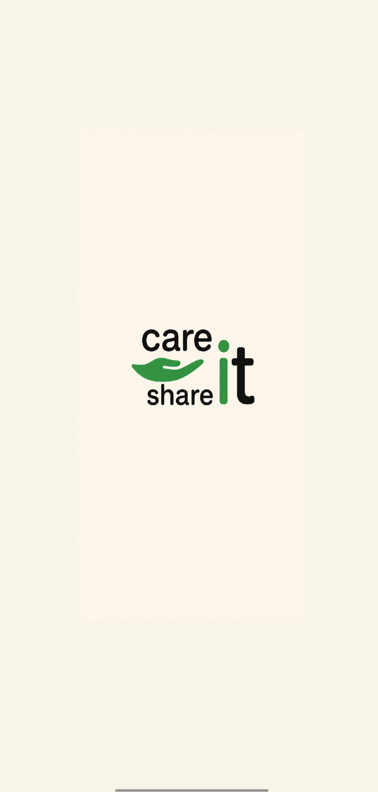
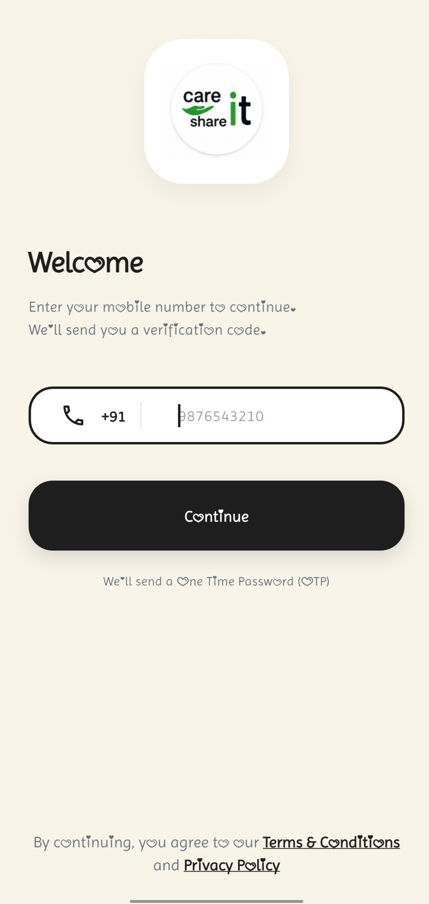
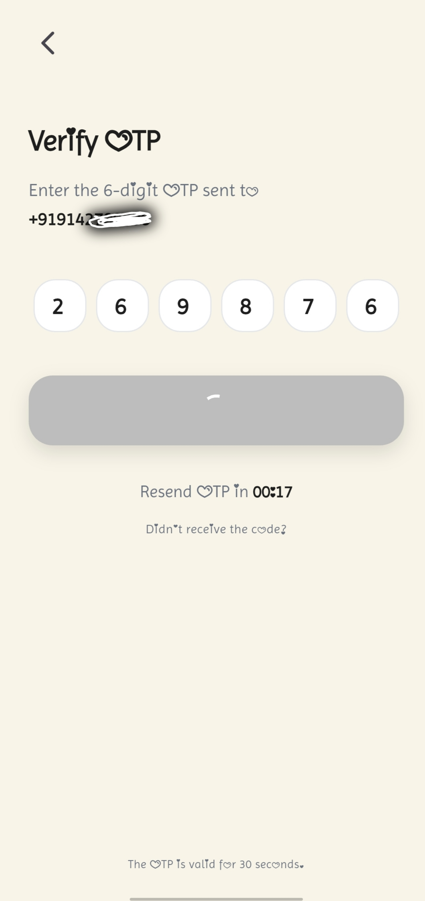
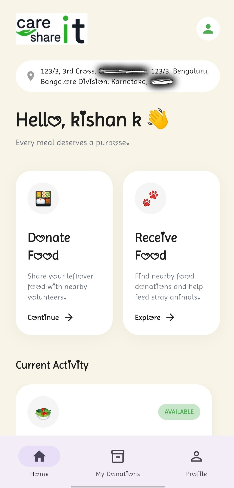
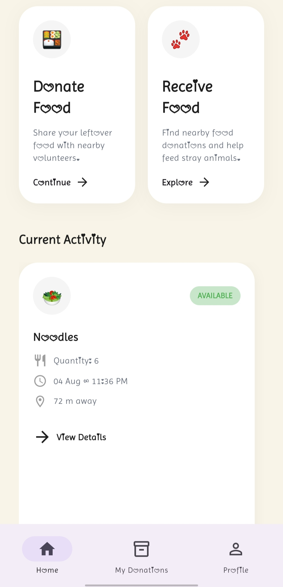
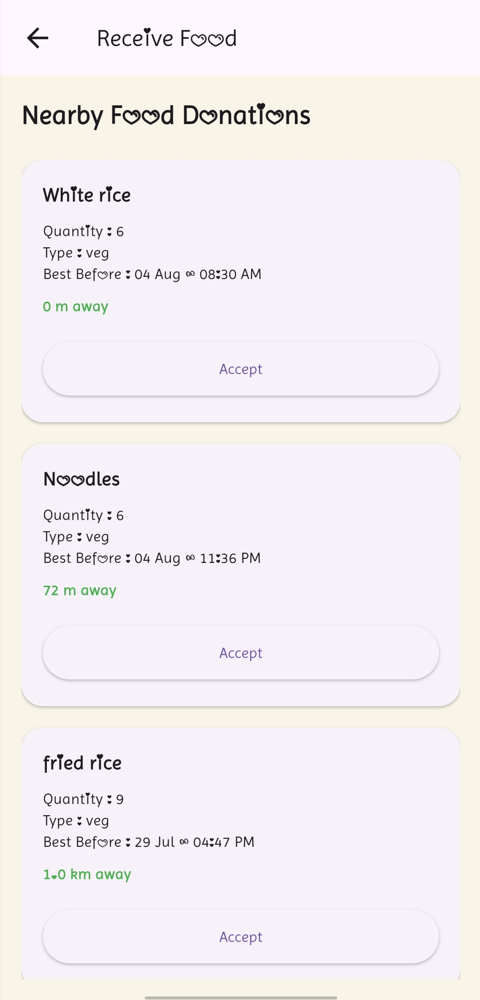
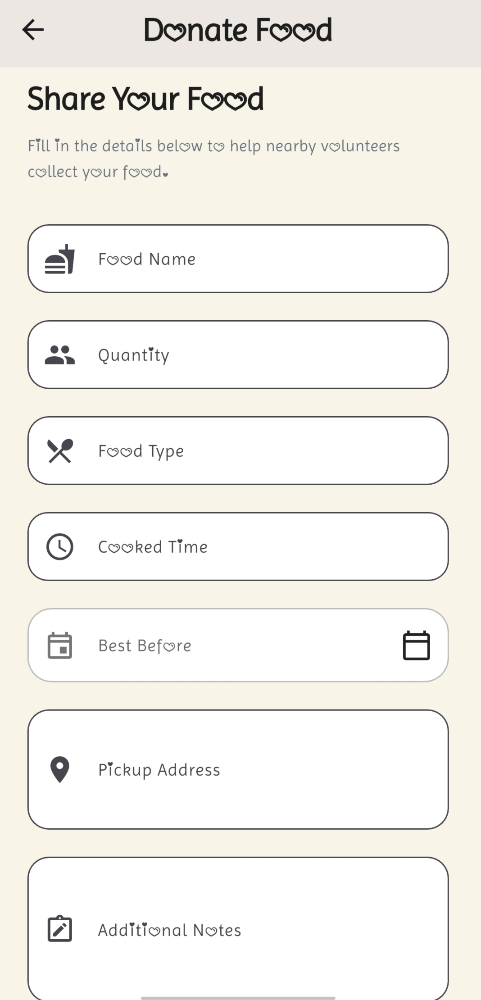
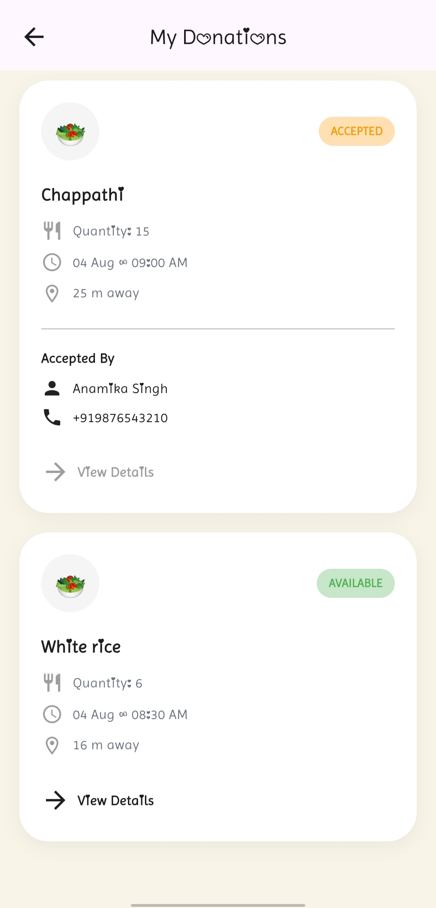
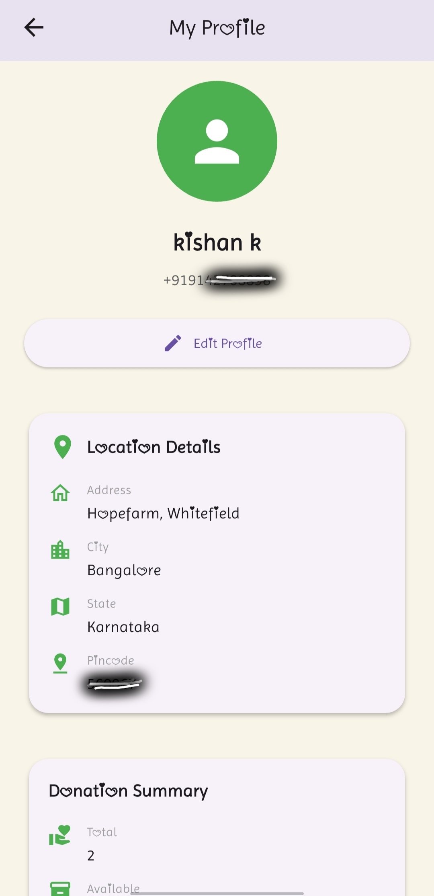
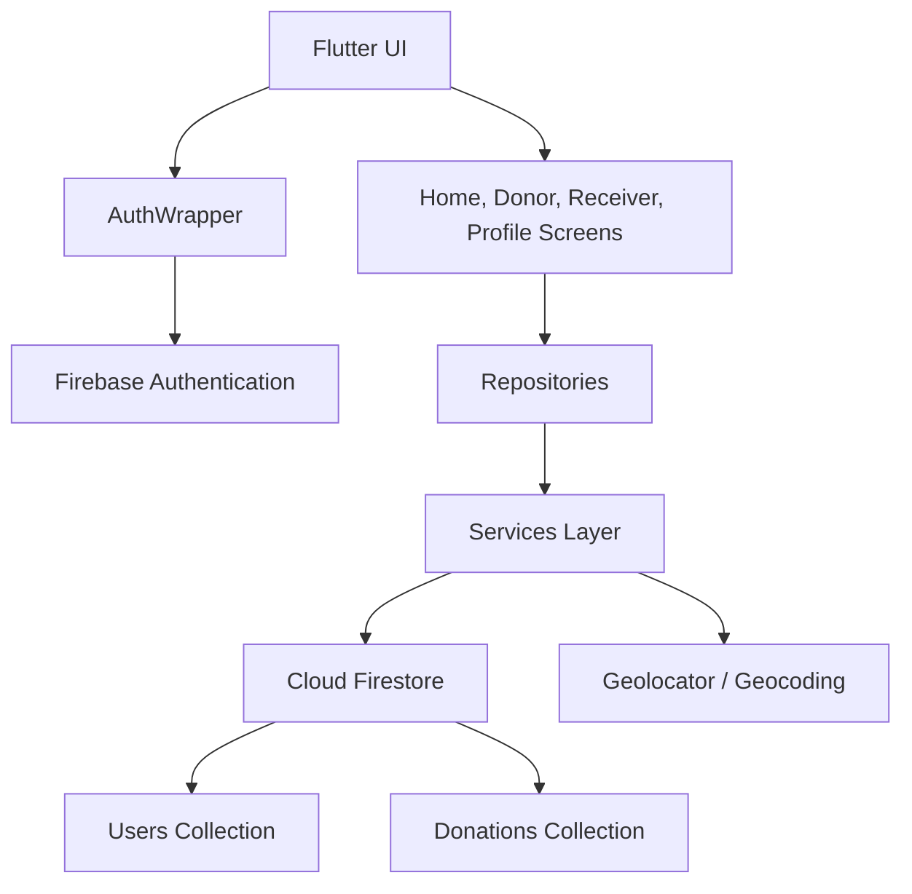

# Care It Share It

<div align="center">
  

  <h3>Location-aware food donation platform built with Flutter and Firebase</h3>

  <p>
    
    
    
    
  </p>

  <p>
    
    
    
  </p>

  <p>
    Care It Share It helps people donate surplus food, lets nearby receivers discover available meals,
    and supports pickup coordination through phone authentication, real-time Firestore data, and
    geolocation-powered discovery.
  </p>
</div>

---

## ✨ Features

| Module              | What It Delivers                                                                               |
| ------------------- | ---------------------------------------------------------------------------------------------- |
| Authentication      | Firebase Phone Authentication with OTP-based sign in flow                                      |
| Onboarding          | Mobile number entry, OTP verification, location permission, and profile completion             |
| Donor Experience    | Create food donation listings with quantity, food type, timing, pickup address, and notes      |
| Receiver Experience | Browse available donations, view distance from current location, and accept pickups            |
| Real-Time Data      | Firestore-backed donation feed with live updates for available, accepted, and completed states |
| Location Awareness  | Uses `geolocator` and `geocoding` to capture user location and estimate receiver distance      |
| Personal Dashboard  | Home view surfaces greetings, current activity, and quick actions for donor and receiver flows |
| Profile Management  | View and edit profile details, location data, and donation summary from one screen             |
| Cross-Platform Base | Flutter codebase with Android, iOS, Web, Windows, and macOS project scaffolding                |

---

## 🧰 Tech Stack

| Category       | Technologies                                                   |
| -------------- | -------------------------------------------------------------- |
| Framework      | Flutter                                                        |
| Language       | Dart                                                           |
| Backend        | Firebase                                                       |
| Authentication | Firebase Authentication                                        |
| Database       | Cloud Firestore                                                |
| Storage        | Firebase Storage                                               |
| Location       | Geolocator, Geocoding                                          |
| Utilities      | Intl, URL Launcher                                             |
| Tooling        | FlutterFire CLI, Flutter Native Splash, Flutter Launcher Icons |

---

## 📸 Screenshots

<table>
  <tr>
    <td align="center" width="25%"></td>
    <td align="center" width="25%"></td>
  </tr>
  <tr>
    <td align="center"><sub><b>Splash Screen</b></sub></td>
    <td align="center"><sub><b>Mobile Number Login</b></sub></td>
  </tr>
  <tr>
    <td align="center" width="25%"></td>
    <td align="center" width="25%"></td>
  </tr>
  <tr>
    <td align="center"><sub><b>OTP Verification</b></sub></td>
    <td align="center"><sub><b>Home Dashboard</b></sub></td>
  </tr>
  <tr>
    <td align="center" width="25%"></td>
    <td align="center" width="25%"></td>
  </tr>
  <tr>
    <td align="center"><sub><b>Home Dashboard Alternate View</b></sub></td>
    <td align="center"><sub><b>Receiver Flow</b></sub></td>
  </tr>
  <tr>
    <td align="center" width="25%"></td>
    <td align="center" width="25%"></td>
  </tr>
  <tr>
    <td align="center"><sub><b>Donate Food Form</b></sub></td>
    <td align="center"><sub><b>My Donations</b></sub></td>
  </tr>
  <tr>
    <td colspan="2" align="center"></td>
  </tr>
  <tr>
    <td colspan="2" align="center"><sub><b>Profile & Donation Summary</b></sub></td>
  </tr>
</table>

---

## 📂 Folder Structure

```text
careit_shareit/
├── android/
├── assets/
├── ios/
├── lib/
│   ├── core/
│   │   └── services/
│   ├── features/
│   │   ├── auth/
│   │   │   ├── auth_wrapper.dart
│   │   │   └── repository/
│   │   ├── donation/
│   │   │   └── presentation/
│   │   ├── location/
│   │   │   ├── models/
│   │   │   └── repository/
│   │   └── receiver/
│   ├── screens/
│   │   ├── auth/
│   │   ├── home_screen.dart
│   │   ├── my_donations_screen.dart
│   │   └── profile_screen.dart
│   ├── theme/
│   ├── widgets/
│   ├── firebase_options.dart
│   └── main.dart
├── macos/
├── screenshots/
├── web/
├── windows/
├── pubspec.yaml
└── README.md
```

---

## 🚀 Installation

<details>
  <summary><strong>Prerequisites</strong></summary>

  <br />

Make sure the following are installed before running the app:

- Flutter SDK
- Dart SDK
- Android Studio or VS Code
- Firebase project access
- Android SDK / Xcode tools for target platforms
</details>

<details>
  <summary><strong>Run the project locally</strong></summary>

  <br />

```bash
git clone https://github.com/Kishankumar-10/careit-shareit.git
cd careit-shareit
flutter pub get
flutter run
```

</details>

<details>
  <summary><strong>Useful Flutter commands</strong></summary>

  <br />

```bash
flutter clean
flutter pub get
flutter analyze
flutter test
flutter run -d chrome
```

</details>

---

## 🔥 Firebase Setup

1. Create a new Firebase project from the Firebase Console.
2. Enable **Phone Authentication** under the Authentication section.
3. Create a **Cloud Firestore** database for user profiles and donation records.
4. Register your Flutter platforms in Firebase:
   - Android app
   - iOS app
   - Web app
   - Windows / macOS if needed for local testing
5. Add platform config files:
   - Keep `android/app/google-services.json` for Android
   - Generate `lib/firebase_options.dart` using FlutterFire CLI for Flutter initialization
6. Run FlutterFire configuration if you want to connect the app to your own Firebase project:

   ```bash
   dart pub global activate flutterfire_cli
   flutterfire configure
   ```

7. Review Firestore security rules before publishing or deploying the project publicly.
8. Run the app and verify:
   - OTP authentication works
   - User profiles save correctly
   - Donations appear in Firestore
   - Receiver acceptance updates donation status

---

## 🏗️ Architecture



| Layer        | Responsibility                                                      |
| ------------ | ------------------------------------------------------------------- |
| UI           | Screens, widgets, navigation, and user interactions                 |
| Repositories | Encapsulate auth, profile, and location access                      |
| Services     | Direct integration with Firebase Auth, Firestore, and location APIs |
| Models       | Typed app data for donations, user location, and profiles           |

---

## 🛣️ Future Improvements

- [ ] Push notifications for accepted and completed donations
- [ ] In-app chat between donors and receivers
- [ ] Advanced filtering for food type, distance, and freshness window
- [ ] Admin moderation and reporting tools
- [ ] Donation history analytics and impact metrics
- [ ] Improved Firestore rules and App Check hardening for public release
- [ ] Production-ready loading, error, and empty states across all screens

---

## 👤 Footer

<div align="center">
  <strong>Author</strong><br />
  Kishan Kumar
  <br /><br />
  If you found this project useful, consider giving it a ⭐
</div>
